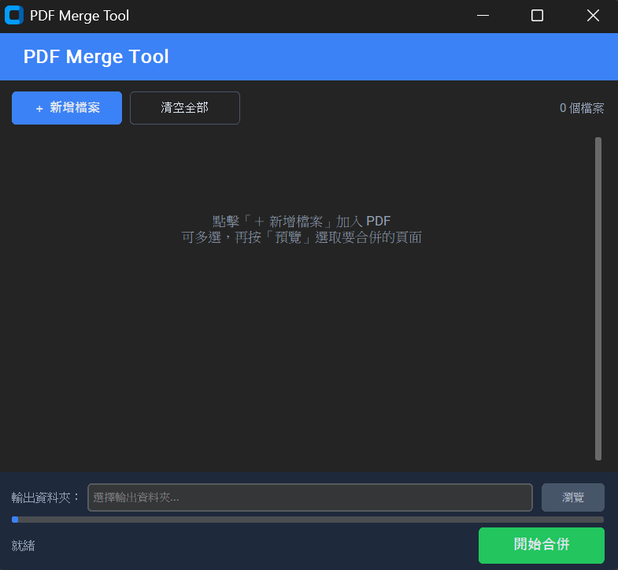

# PDF Merge Tool

你還在用網頁合併PDF文件嗎？在網頁合併機密敏感的PDF文件可是很危險的喔  
作者之前打工的單位把客戶的重要資料上傳合併網站合併，居然還是辦公室的標準SOP  
我看不下去
所以第一版就是作者當時寫的合併小工具，有了AI的幫助下把前端介面跟UX提升了很多  
因此有了v2.0.0版本啦!

## Download

**[>>> 點此下載最新版 .exe <<<](https://github.com/submarine0418/PDFMergetool/releases/tag/v2.0.0)**

> 不需要安裝 Python，下載後直接執行即可。


## Features

- **Multiple file merge** — add unlimited PDF files, not just two
- **Page preview & selection** — click thumbnails to pick pages, no manual input needed
- **Reorder files** — move files up/down to control merge order
- **Modern dark UI** — clean card-based layout with customtkinter
- **Progress indicator** — real-time progress bar during merge
- **Folder output** — select output folder, auto-naming with conflict avoidance

## 新功能

- **多檔合併** — 不限數量，一次合併多個 PDF
- **頁面預覽選取** — 點擊縮圖選擇頁面，不需手動輸入頁碼
- **自由排序** — 上下移動檔案順序
- **深色現代介面** — 卡片式排版，基於 customtkinter
- **即時進度條** — 合併時顯示處理進度
- **資料夾輸出** — 選擇輸出資料夾，可自訂檔名，自動避免覆蓋

## Screenshot

> _Run the app to see the modern dark-themed interface._



## Download

Pre-built executable available in the `dist/` folder:
- Windows: `PDFMergeTool.exe`

## Usage

1. Click **＋ 新增檔案** to add PDF files (multi-select supported)
2. _(Optional)_ Enter page ranges for each file, e.g. `1-3, 5, 8-10`. Leave blank for all pages.
3. Use **▲ ▼** buttons to reorder files
4. Click **瀏覽** to choose an output file location
5. Click **開始合併**

## Installation

### From Source

```bash
pip install -r requirements.txt
python PDF_Merge.py
```

### Build Executable

```bash
# Windows
build_exe.bat
```

## Requirements

- Python 3.8+
- [customtkinter](https://github.com/TomSchimansky/CustomTkinter)
- [PyPDF2](https://pypi.org/project/PyPDF2/)

## License

[MIT](LICENSE)


